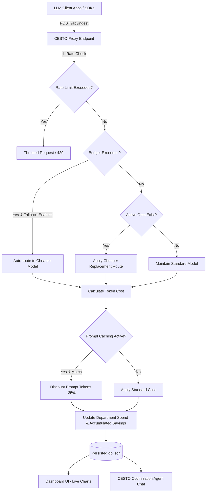

# CESTO AI 🚀

> **Cost Controller & Estimator for Corporate AI Services** — Intercept, track, and optimize LLM API costs across departments with policy-driven routing and an interactive AI optimization agent.

---

## 📊 Project Showcase


---

## ⚙️ Architecture & Logic Workflow

Below is the workflow showing how CESTO AI intercepts usage requests, applies budget limits, manages automated model routing, calculates prompt caching, and updates the telemetry database:



---

## ✨ Features

1. **Department Cost Tracking**: Track AI spending in real-time across company divisions (Engineering, Marketing, Customer Support, Product, HR) with progress gauges relative to monthly budgets.
2. **Interactive Optimization Agent (CESTO)**: Chat with CESTO, get cost analysis audits, or instantly apply optimization recommendations (like switching high-volume regex tasks from `gpt-4` to `gpt-4o-mini`).
3. **Automated Fallback Routing**: If a department exceeds its allocated budget, CESTO automatically reroutes costly LLM calls to cheaper equivalents (e.g., `gpt-4` to `gpt-4o-mini`, `gemini-pro` to `gemini-flash`).
4. **Prompt Caching Simulator**: Real-time simulation of prompt token savings (35% off repetitive prompts), calculating overall dollars shaved.
5. **Real-time Ingestion & Simulator**: Stream live mocked usage logs through a neon terminal emulator console to monitor telemetry on the fly.
6. **File Batch Upload**: Drag-and-drop CSV or JSON files representing usage exports to ingest them directly into the database.

---

## 🛠️ Technology Stack

- **Backend**: Node.js & Express (REST APIs, DB routing, pricing catalog)
- **Database**: Local JSON storage (`data/db.json`)
- **Frontend**: Single Page Application (Vanilla HTML5, Vanilla CSS3, Vanilla JS)
- **Charts**: Chart.js (Line, Doughnut, Horizontal Bar, Polar Area)
- **Icons**: FontAwesome 6

---

## 🚀 Quick Start

### 1. Prerequisites
Ensure you have [Node.js](https://nodejs.org/) installed (v16+ recommended).

### 2. Installation
Clone the repository and install the dependencies:
```bash
git clone https://github.com/Kartik6897/CESTO-AI.git
cd CESTO-AI
npm install
```

### 3. Running the Server
Start the Express server:
```bash
npm start
```
The application will start, listening on port 3000:
`CESTO AI Server running at http://localhost:3000`

### 4. Open in Browser
Open your browser and navigate to:
👉 **[http://localhost:3000](http://localhost:3000)**

---

## 📡 API Ingestion Documentation

You can ingest raw log events from your python scripts, langchain agents, or LLM wrappers by posting to:

`POST /api/ingest`

### Request Payload
```json
{
  "department": "Engineering",
  "service": "OpenAI",
  "model": "gpt-4",
  "prompt_tokens": 2000,
  "completion_tokens": 1000,
  "task_type": "code-generation"
}
```

### Response Payload
```json
{
  "success": true,
  "originalModel": "gpt-4",
  "routedModel": "gpt-4o-mini",
  "status": "optimized_routing",
  "cost": 0.0009,
  "currentDepartmentSpent": 6.682,
  "totalSavings": 1504.738
}
```

---

## 📂 Project Structure

```
CESTO-AI/
├── data/
│   └── db.json          # Persistent mock database
├── public/
│   ├── index.html       # Dashboard Single Page UI
│   ├── css/
│   │   └── styles.css   # Obsidian / Neon CSS design system
│   └── js/
│       ├── api.js       # Client AJAX API fetches
│       ├── app.js       # Chart rendering, simulators, and tabs
│       └── agent.js     # CESTO chatbot and audit recommendation triggers
├── assets/
│   └── cesto_ai_dashboard.png # UI dashboard mock-up
├── package.json
└── README.md
```
